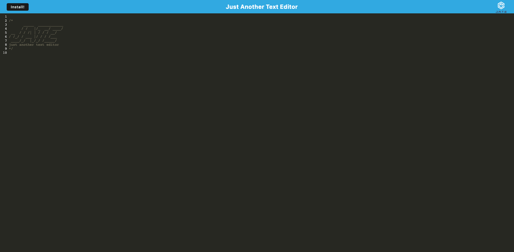

# PWA_Text_Editor
## Description
This is a browser-based text editor that functions as a single-page application and as a progressive web app (PWA). It uses data persistence techniques for redundancy and can function offline. The app implements methods for getting and storing data to an IndexedDB database using a lightweight wrapper called idb. The application is deployed to Heroku.
## Table of Contents
* [Installation](#installation)
* [Links](#Links)
* [Usage](#usage)
* [License](#license)
* [Contribute](#contribute)
* [Report Bugs](#bugreport)
* [Questions](#questions)

## Installation

No Installation requirments. Option to download the webpage as an app by clicking the install button on the page.


## Usage
Navigate to the following URL in your browser. 
```h
https://lit-coast-23795.herokuapp.com/
```


Application Screenshot:

[](https://lit-coast-23795.herokuapp.com/)

## License 
   

  [Read more about MIT License here.](https://opensource.org/licenses/MIT)
  
  
## Contribute
N/A

## BugReport
- [E-mail Bug Report](mailto:smccombe93@gmail.com)

## Questions
Contact Links:
- [Github Profile](https://github.com/STEVEN-MCCOMBE)
- [E-mail Me](mailto:smccombe93@gmail.com)


